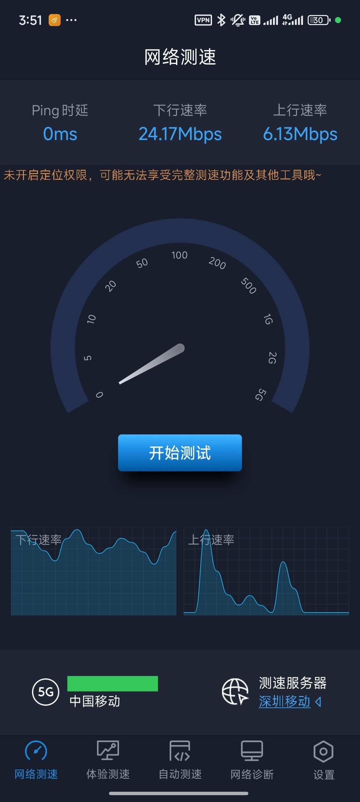
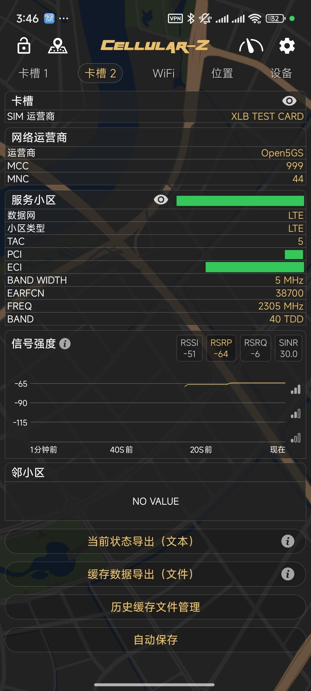
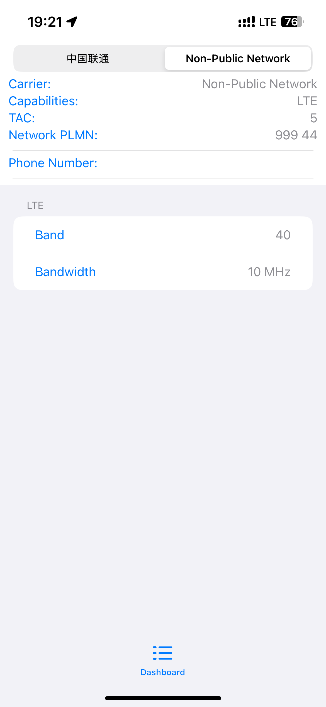
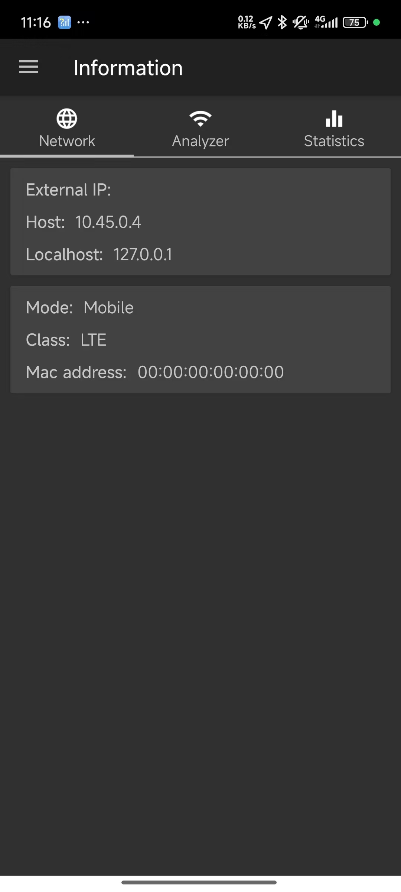

# Open5GS Experiments

We tested on some Open5GS + COTS B40 eNodeBs:

- Comba ENB-35 series
- Baicells Neutrino series

With the following UEs:

- iPhone 16e (A3410)
- Xiaomi 13 (221133G)

## Network Configuration Details

Test network parameters:
- PLMN ID: 99944
- TAC: 5

## Performance Results

Speed test results with default settings (B40, 2305MHz):
- Downlink: ~25 Mbps
- Uplink: ~6 Mbps
- Bandwidth: 5MHz

## Radio Information

    

        <h3>Xiaomi 13 Radio Details</h3>
        
    

    

        <h3>iPhone 16e Radio Details</h3>
        
    

## Network Configuration

### iPhone Connection Details

### Xiaomi Network Configuration

